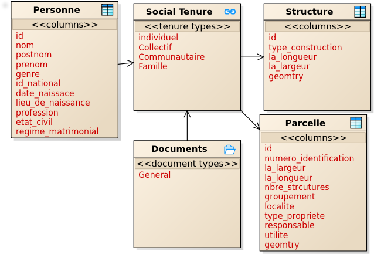

## Social Economics

Context: The party entity in the configuration is person and spatial unit entities are Parcel/Plot of land and House unit. The data profile was applied in Rural settings.

**Social Tenure Relationship (STR) Data Model**

