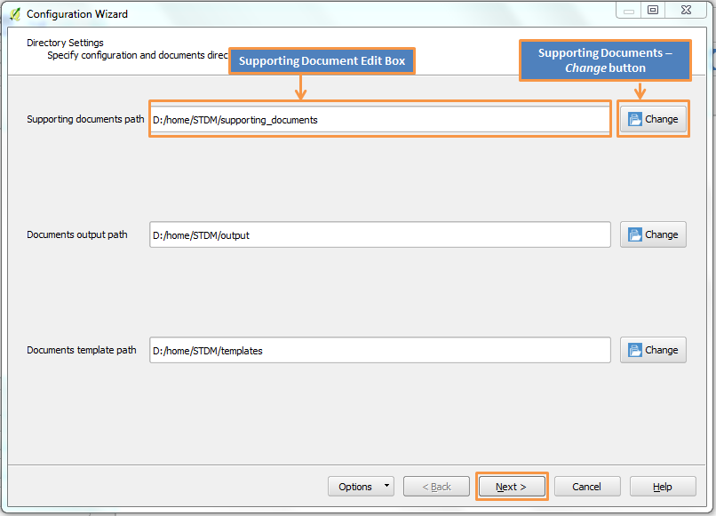
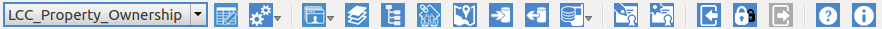

**STDM Customizations**
==============================

### Data Profiles
A set of the respective STDM data profile customizations at the country level. The STDM data profiles configurations have a file extension of **.stc** i.e. **configuration.stc**.

See the topic on Creating and Customizing Data Profiles in the user manual https://www.stdm.gltn.net/docs/1_7/#t=Getting_Started.htm

### Report Templates
A set of the respective STDM report templates to generate documents based on STDM data profile customizations. The STDM report templates have a file extension of **.sdt** i.e. **Certificate of Parcel Ownership Sample.sdt**.

See the topic on Designing and Generating Documents in the user manual: [Desing a Document Template](https://www.stdm.gltn.net/docs/1_7/Designing_a_Document_Template.htm) & [Generating Documents Using Templates](https://www.stdm.gltn.net/docs/1_7/Generating_Documents_Using_Templates.htm)

### Organization Overview

The STDM data profiles and report templates are organized according to application contexts within countries i.e. Zambia has two application contexts namely: Customary Land  and Informal Settlement.

### Prerequisites

1. A running version of STDM v1.7.4 or higher. The following is the [Installation Guide](https://github.com/gltn/stdm)

	- On Windows, select the appropriate **[Bundled STDM Installer](https://www.stdm.gltn.net/docs/1_7/#t=usingbundledstdminstaller.htm)** and follow this installation guide [Using Bundled STDM Installer](https://www.stdm.gltn.net/docs/1_7/#t=usingbundledstdminstaller.htm).

	- On Ubuntu, use the following installation guide [Installing from GLTN Plugin Repository](https://www.stdm.gltn.net/docs/1_7/#t=installingfromgltnpluginreposito.htm)

	- **Note:** During the [configuration of the directory settings](https://www.stdm.gltn.net/docs/1_7/#t=Modifying_Supporting_Document_Path.htm), take note of the directory path of the **STDM (.stdm)**.

		- Windows: `C:\Users\<Username>\.stdm\`

		- Ubuntu: `/home/<username>/.stdm/`	

		 	

2. A git package to clone the STDM - configurations from the github repository. Select the appropriate package below depending on the platform and follow the installation guide provided:

	- Windows [Installation Guide](https://www.atlassian.com/git/tutorials/install-git#windows)

	- Ubuntu [Installation Guide](https://www.atlassian.com/git/tutorials/install-git#linux)

	- Mac [Installation Guide](https://www.atlassian.com/git/tutorials/install-git#mac-os-x)

### Installation

A. STDM data profiles/configuration can be installed in two ways:

1. For beginners - download [stdm-configurations-master.zip](https://github.com/gltn/stdm-configurations/archive/master.zip)
	
	1. Extract/unzip the **stdm-configurations-master.zip** file.

	2. Select the most suitable application context of a country and rename it to **configuration.stc** e.g. e.g. In the case for Uganda, rename **configuration.stc_Uganda_Customary_Ownership_UGANDA** to **configuration.stc**

	3. Locate the STDM directory created during STDM v1.7.4 installation. 

		1. Check the _Home_ directory for the **.stdm** directory or where you created it.

		2. Show the files/directories to locate the **.stdm** directory 

	4. Copy/move the **configuration.stc** to the base directory of the STDM directory.

	5. Restart your QGIS application.

	6. The STDM data profile/configuration should be now available for selection.

		

	7. Follow the [STDM Getting Started Tutorial](https://www.stdm.gltn.net/docs/1_7/#t=Getting_Started.htm)

2. For advanced users - use git clone. The steps are:
		
	1. On the STDM - configuration repository, clone or download the repo 

    2. Rename the customized STDM - configuration to configuration.stc e.g. In the case for Uganda, rename **configuration.stc_Uganda_Customary_Ownership_UGANDA** to **configuration.stc**

    3. Locate the STDM directory created during STDM v1.7.4 installation. 

		1. Check the _Home_ directory for the **.stdm** directory or where you created it.

		2. Show the files/directories to locate the **.stdm** directory 

    4. Copy/move the customized STDM **configuration.stc** to the STDM base directory **(.stdm)**

	5. Restart your QGIS application

	6. Once you login into STDM, the **LCC_Property_Ownership** will be available for selection as shown below

		

	7. Follow the [STDM Getting Started Tutorial](https://www.stdm.gltn.net/docs/1_7/#t=Getting_Started.htm)

B. STDM report templates can be installed by:

1. Copy/move the custom STDM report template to the STDM base directory **.stdm** into the reports > templates directory i.e. **.stdm/reports/templates/_Certificate of Parcel Ownership Sample.sdt_**

### License

The STDM data profile and report template customizations (configurations) are free resources; adapting the same license as the STDM tool hence you can redistribute it and/or modify it under the terms of the GNU General Public License version 3 (GPL v3) as published by the Free Software Foundation. The full GNU General Public License is available in LICENSE.txt or [here](http://www.gnu.org/licenses/gpl-3.0.html).