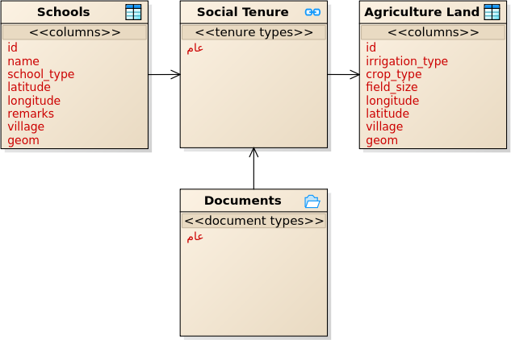

## Post Conflict

Context: This extensive configuration was used to collect data for a number of villages in different states of Darfur in northern Sudan. Some of the entities on this profile included; Village Boundary and Buffer details, Schools, Population, Natural Disasters, Topographic Features etc.

**Social Tenure Relationship (STR) Data Model**

