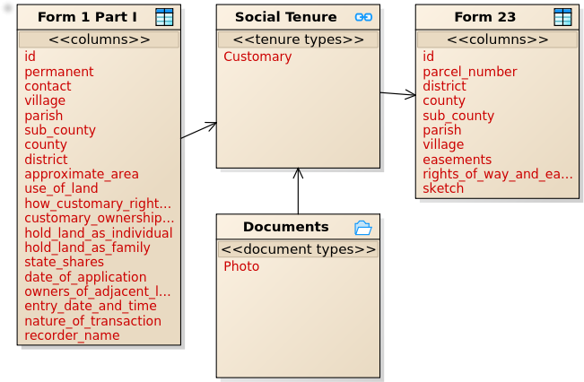

## Customary Land
	
Context: The profile is based on Uganda's Customary Land Tenure system where entities conform to the Government of Uganda Customary Land Tenure forms and is used to generate Certificates of Customary Ownership (CCO) for Kabale, Uganda. 

**Social Tenure Relationship (STR) Data Model**

