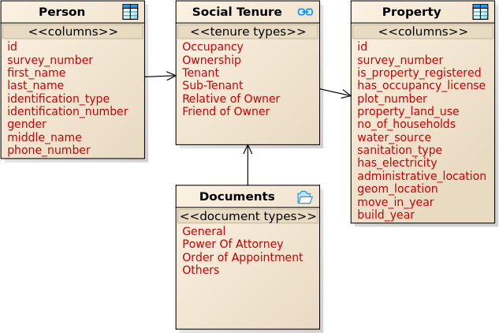
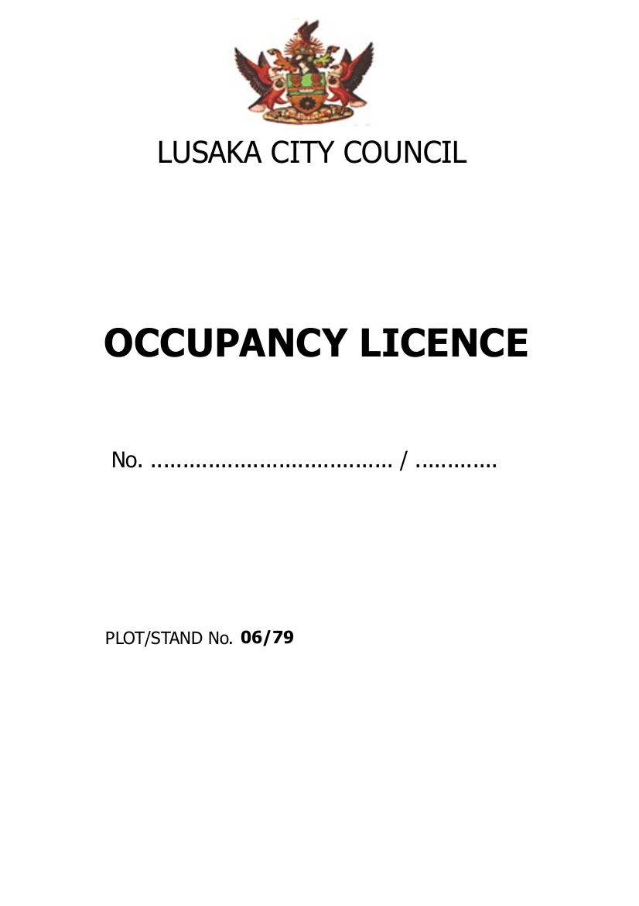
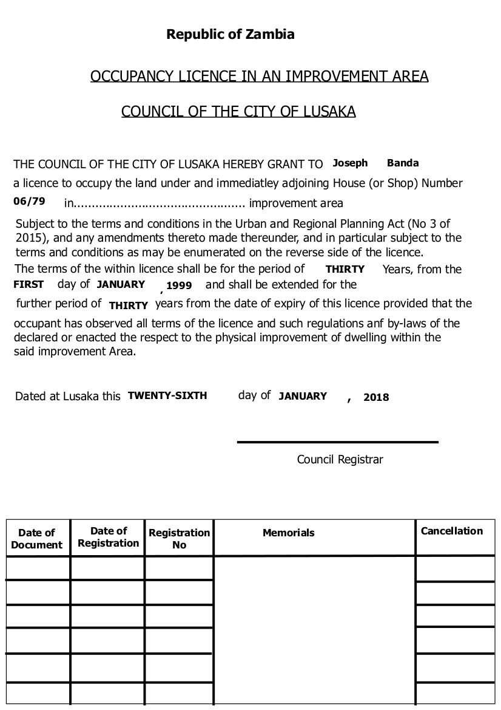
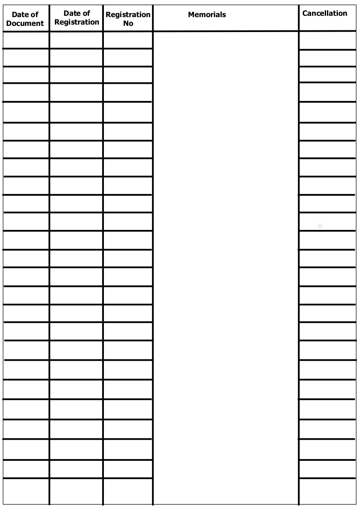

### **Lusaka City Council**

Context: This configuration represents properties owned by persons for purposes of issuing Occupancy licenses for the informal settlement in Kanyama, Ward 10, Zambia. 

**Social Tenure Relationship (STR) Data Model**

**Sample output: Certificate of Occupancy License for LCC Zambia**

