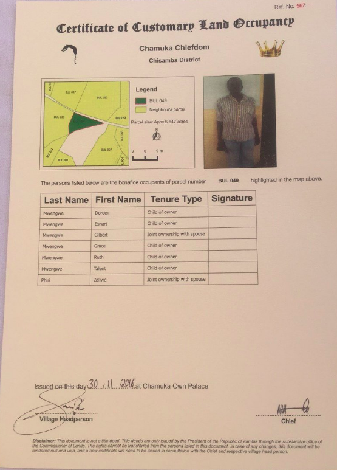

**Zambia**
==============================

## Country themes

### 1.**Customary Land Ownership: Lusaka City Council (LCC) Property Ownership**

Context: 

**Example of Certificate of Customary Land Occupancy**

### 2.**Informal Settlement**

Context: The context of this configuration represents property ownership for the informal settlement in Lusaka. This configuration was used by LCC to collect data of person and properties owned for purposes of issuing Certificate of Ownership.

**Example of Certificate of Informal Settlement**

### License

The STDM - configurations is a free software; you can redistribute it and/or modify it under the terms of the GNU General Public License version 3 (GPL v3) as published by the Free Software Foundation. The full GNU General Public License is available in LICENSE.txt or [here](http://www.gnu.org/licenses/gpl-3.0.html).